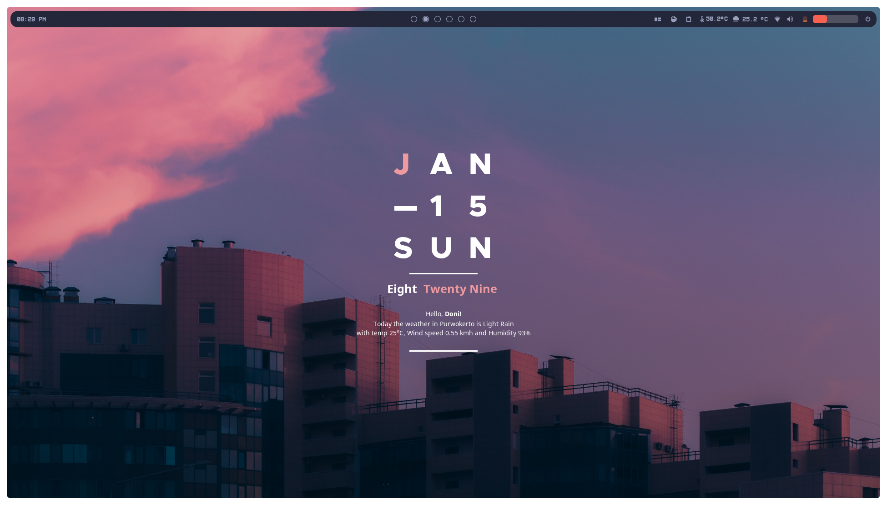
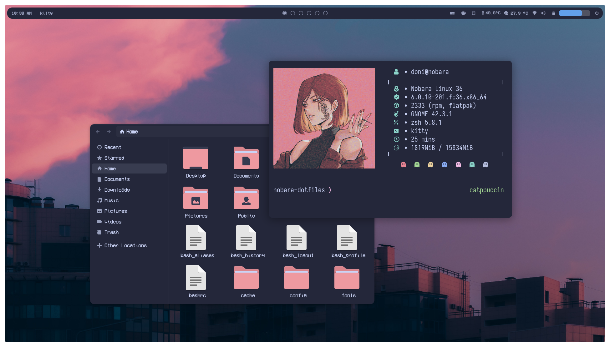
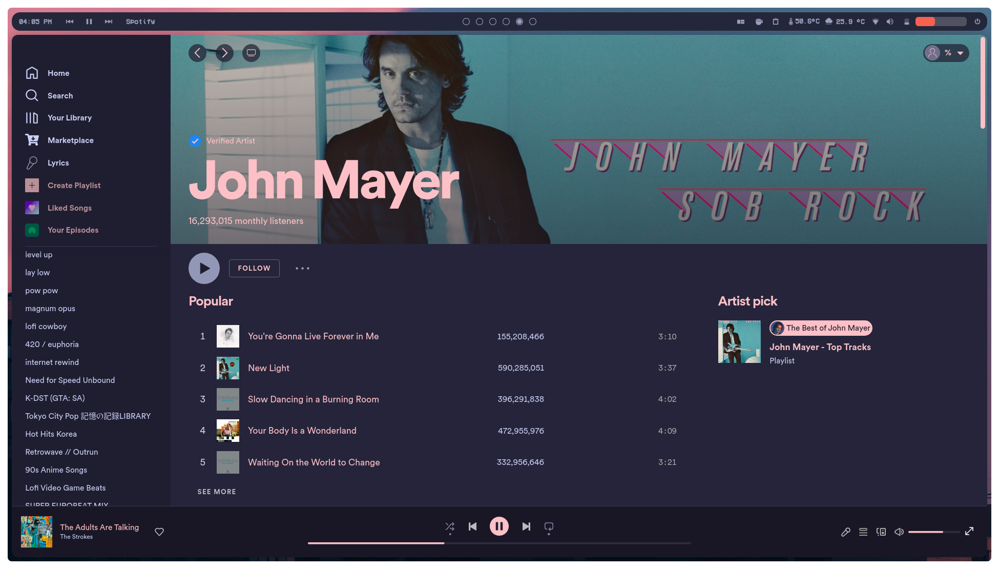
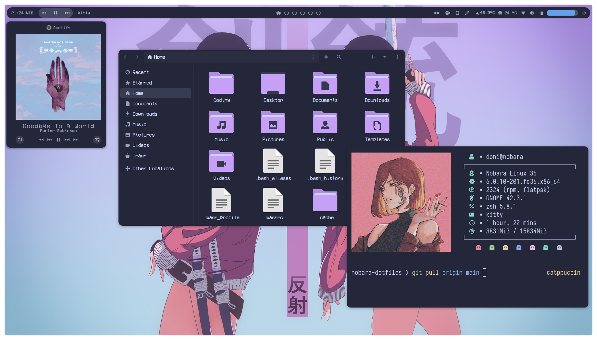
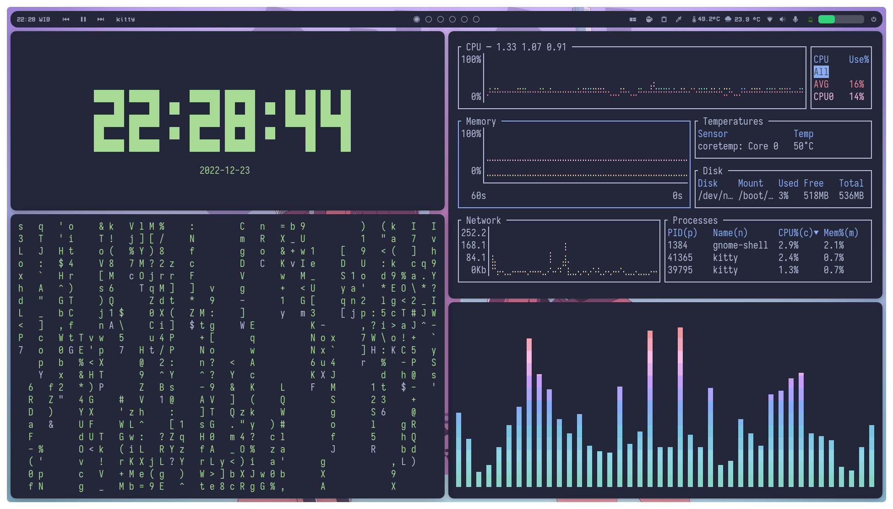
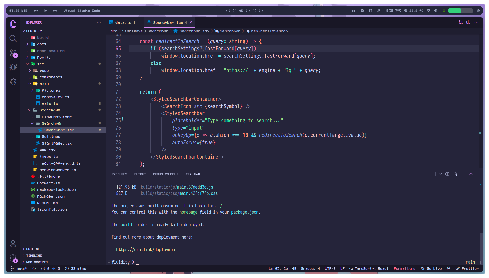

<h3 align="center">
	<br/>
	
	<samp>~/.nobara-dotfiles</samp>
	
</h3>

<p align="center">
  
</p>

<p align="center">
  
  
  
  
</p>

<!--
...
-->

## <samp>🌸 screenshots</samp>

<!--  -->


<!--  -->



<!--  -->


## <samp>⚠️ important</samp>

- the rice is done on gnome 42.x and probably will not work on older version, some of the extensions are comes pre-installed(\*) from nobara 36, which is the distro i use
- you can remove titlebar buttons to achieve more minimalism:
  ```bash
  # dont forget to set some keyboard shortcuts before applying
  gsettings set org.gnome.desktop.wm.preferences button-layout :
  ```

- to load extensions settings, install the extensions first then run commands below:
  ```bash
  # assuming you are already in this dotfiles directory
  cd preset
  dconf load /org/gnome/shell/extensions/ < extensions.conf
  ```

- theres a [`stylesheet.css`](https://github.com/slashedzer0/nobara-dotfiles/tree/catppuccin/preset/dash-to-dock@micxgx.gmail.com) from dash-to-dock that i tweaked a bit, you can use it by running:
  ```bash
  # assuming you are already in 'preset' directory (do backup first!)
  cd dash-to-dock@micxgx.gmail.com
  cp stylesheet.css ~/.local/share/gnome-shell/extensions/dash-to-dock@micxgx.gmail.com/

  # or if your OS comes with dash-to-dock extension by default (root access needed)
  sudo cp stylesheet.css /usr/local/share/gnome-shell/extensions/dash-to-dock@micxgx.gmail.com/
  ```

- the top panel is based on catppuccin gtk, i simply modified some lines in `gnome-shell.css` to adjust my preference

## <samp>✨ setup</samp>

| what | desc | program |
|---|---|---|
| terminal | emulator | [kitty](https://github.com/kovidgoyal/kitty) |
|| shell | [zsh](https://github.com/zsh-users/zsh) |
|| framework | [zinit](https://github.com/zdharma-continuum/zinit) |
|| prompt | [common](https://github.com/jackharrisonsherlock/common) |
| desktop | theme | [catppuccin](https://github.com/catppuccin/gtk) |
|| icons | [papirus](https://github.com/PapirusDevelopmentTeam/papirus-icon-theme) / [papirus-folders](https://github.com/catppuccin/papirus-folders) |
|| fonts | [vcr osd mono](https://www.dafont.com/vcr-osd-mono.font) / [iosevka nf](https://github.com/ryanoasis/nerd-fonts/tree/master/patched-fonts/Iosevka) |
|| cursor | [macos monterey](https://github.com/ful1e5/apple_cursor) |
|| widget | [conky](https://www.pling.com/p/1832702/) |
| extensions | pre-installed | [dash to dock](https://extensions.gnome.org/extension/307/dash-to-dock/) / [blur my shell](https://extensions.gnome.org/extension/3193/blur-my-shell/) / [just perfection](https://extensions.gnome.org/extension/3843/just-perfection/) / [pop shell](https://github.com/pop-os/shell) / [volume mixer](https://extensions.gnome.org/extension/3499/application-volume-mixer/) / [auto move windows](https://extensions.gnome.org/extension/16/auto-move-windows/) / [caffeine](https://extensions.gnome.org/extension/517/caffeine/) / [gsconnect](https://extensions.gnome.org/extension/1319/gsconnect/) / [openweather](https://extensions.gnome.org/extension/750/openweather/) / [gesture improvements](https://extensions.gnome.org/extension/4245/gesture-improvements/) / [clipboard history](https://extensions.gnome.org/extension/4839/clipboard-history/) |
|| required | [user themes](https://extensions.gnome.org/extension/19/user-themes/) / [aylur widgets](https://extensions.gnome.org/extension/5338/aylurs-widgets/) / [rounded corners](https://extensions.gnome.org/extension/5237/rounded-window-corners/) / [media controls](https://extensions.gnome.org/extension/4470/media-controls/) / [compiz magicfx](https://extensions.gnome.org/extension/3740/compiz-alike-magic-lamp-effect/) / [vitals](https://extensions.gnome.org/extension/1460/vitals/) |
| cli | fetch | [neofetch](https://github.com/dylanaraps/neofetch) |
|| visualizer | [cava](https://github.com/karlstav/cava) |
|| clock | [tty-clock](https://github.com/xorg62/tty-clock) |
|| monitor | [bottom](https://github.com/ClementTsang/bottom) / [htop](https://github.com/htop-dev/htop) |
|| cheatsheet | [tldr](https://github.com/tldr-pages/tldr) |
|| downloader | [yt-dlp](https://github.com/yt-dlp/yt-dlp) |
|| fan control | [nbfc-linux](https://github.com/nbfc-linux/nbfc-linux) |
|| disk analyzer | [duf](https://github.com/muesli/duf) / [ncdu](https://dev.yorhel.nl/ncdu) |

## <samp>💫 acknowledgments</samp>

Catppuccin Team / micheleg / Chick2D / IdliDev / closebox73

<p align="center"></p>
